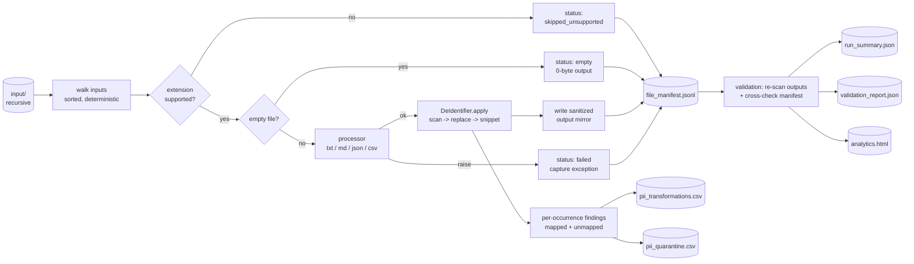
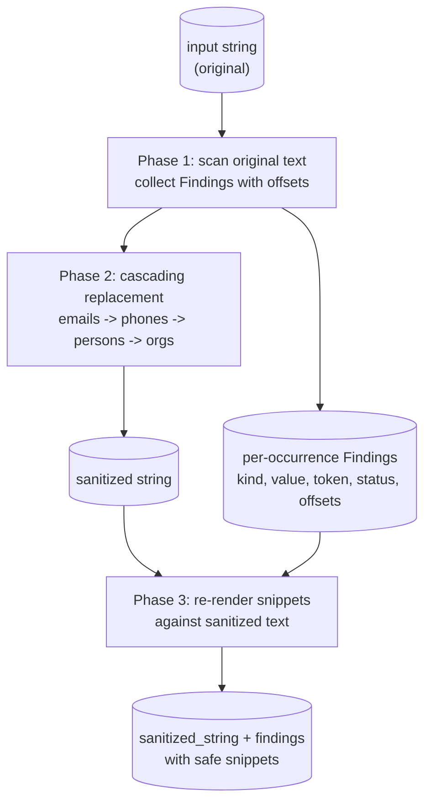

# Local Data Sanitization Pipeline

A deterministic, dependency-free Python pipeline that walks a folder of
exported enterprise data, applies a config-driven de-identification pass
to supported text-like files, and emits a sanitized output tree plus a
full set of audit artifacts.

The transformation itself is small (regex + an alias config). The
emphasis is the pipeline **around** the transformation: failure
isolation, deterministic traversal, manifesting, validation, run
observability, and a row-level audit trail of every PII match acted on.

---

## Table of contents

- [Quick start](#quick-start)
- [Architecture](#architecture)
- [Pipeline flow](#pipeline-flow)
- [De-identification engine](#de-identification-engine)
- [Outputs](#outputs)
- [Repository layout](#repository-layout)
- [Testing](#testing)
- [Engineering notes](#engineering-notes)
- [Documentation](#documentation)

---

## Quick start

Requires Python 3.9+. Standard library only at runtime; `pytest` is the
only dev dependency.

```bash
python -m pip install -e .[dev]
python -m sanitizer --input sample_input --output output
```

Expected output:

```
Run 20260508_023409: 5 processed / 4 skipped / 1 failed / 0 empty / 4 unmapped records - validation: PASSED
  summary:             output/reports/run_summary.json
  manifest:            output/reports/file_manifest.jsonl
  validation:          output/reports/validation_report.json
  pii_transformations: output/reports/pii_transformations.csv (52 records)
  pii_quarantine:      output/reports/pii_quarantine.csv (4 records)
  analytics:           output/reports/analytics.html
```

### CLI flags

| flag        | required | description                                               |
| ----------- | -------- | --------------------------------------------------------- |
| `--input`   | yes      | folder to walk recursively                                |
| `--output`  | yes      | folder to write `sanitized/` and `reports/` into          |
| `--config`  | no       | path to entities config (default: `config/entities.json`) |
| `--verbose` | no       | print one line per file outcome + run-boundary events     |

### Exit codes

| code | meaning                                                                            |
| ---- | ---------------------------------------------------------------------------------- |
| `0`  | run completed and validation passed                                                |
| `2`  | completed with warnings (skipped/failed/empty/unmapped) **or** validation found a leak |
| `1`  | catastrophic failure before reports could be produced                              |

---

## Architecture

The pipeline is layered into three concerns:

1. **Input & processing** — recursive sorted walk, classification by
   extension, per-extension processor inside a per-file `try/except`
   for failure isolation.
2. **De-identification** — three-phase apply (scan → cascading
   replacement → snippet rendering).
3. **Evidence & validation** — manifest, run summary, two row-level
   PII reports, independent post-run validation, analytics dashboard.

### Supported file types

| extension     | reader           | writer                        | notes                                                            |
| ------------- | ---------------- | ----------------------------- | ---------------------------------------------------------------- |
| `.txt`, `.md` | UTF-8 text       | UTF-8 text                    | sanitize the whole document                                      |
| `.json`       | `json.load`      | `json.dumps(indent=2)`        | recursively sanitize string values; numbers/bools/null pass through |
| `.csv`        | `csv.DictReader` | `csv.DictWriter`              | sanitize cell values; headers preserved verbatim                 |

Anything else (`.pdf`, `.png`, `.xlsx`, `.zip`, ...) is recorded as
`skipped_unsupported` in the manifest. Unsupported file bytes are
never opened.

---

## Pipeline flow

End-to-end behavior for a single run:



The validator audits the **written artifacts**, not in-memory state.
That makes evidence independent of the happy path.

---

## De-identification engine

### Three-phase apply

The de-identifier runs in three phases so that match locations and
snippets are both honest:



- **Phase 1** scans for offsets against the *original* text, so `line N`
  in a finding points to line N of the file the operator opens.
- **Phase 2** does cascading replacement in a fixed order
  (`emails -> phones -> persons -> organizations`, longest alias first).
- **Phase 3** renders snippets from the *sanitized* text, so the focal
  value and any neighboring PII appear as tokens. Snippets are
  log-safe.

### Replacement order

```
emails  ->  phones  ->  persons (longest alias first)  ->  organizations (longest alias first)
```

Order is hard-coded for correctness. Examples:

- **Emails first** — otherwise `BetaHealth` could match inside
  `sarah@betahealth.io`, leaving leakage.
- **Phones before names/orgs** — phones are well-bounded; alias regexes
  could chew apart a phone-shaped substring otherwise.
- **Longest alias first** — `Sarah Chen` runs before `Sarah` so we don't
  end up with `PERSON_002 Chen`.

Worked example for *emails before orgs*:

| step             | wrong order (orgs first)             | correct order (emails first) |
| ---------------- | ------------------------------------ | ---------------------------- |
| input            | `sarah@betahealth.io`                | `sarah@betahealth.io`        |
| after first pass | `sarah@ORG_001.io` (domain corrupted)| `EMAIL_002`                  |
| after second pass| email regex finds no valid email     | nothing left for org pass    |
| outcome          | **leak** (`sarah` + `.io` remain raw)| **clean**                    |

### Mapped vs unmapped

| kind     | configured? | sanitized output    | report                      |
| -------- | ----------- | ------------------- | --------------------------- |
| email    | yes         | `EMAIL_001`         | `pii_transformations.csv`   |
| phone    | yes         | `PHONE_001`         | `pii_transformations.csv`   |
| person   | yes         | `PERSON_001`        | `pii_transformations.csv`   |
| org      | yes         | `ORG_001`           | `pii_transformations.csv`   |
| email    | no          | `<UNMAPPED_EMAIL>`  | `pii_quarantine.csv`        |
| phone    | no          | `<UNMAPPED_PHONE>`  | `pii_quarantine.csv`        |

Unmapped values get a *generic* placeholder (not a hash-based
pseudonym) so the unreviewed state is visually obvious in the
sanitized text. The triage loop is `regex detects unknown -> mask in
output -> row in pii_quarantine.csv -> operator reviews and adds to
config/entities.json -> re-run -> finding migrates to
pii_transformations.csv`.

### Configuration

`config/entities.json` is **person-centric**: aliases, emails, and phones
live under the entity that owns them.

```json
{
  "persons": [
    {
      "canonical_id": "PERSON_002",
      "aliases": ["Sarah Chen", "Sarah"],
      "emails": [{"value": "sarah@betahealth.io", "token": "EMAIL_002"}],
      "phones": [{"value": "+1-212-555-0199", "token": "PHONE_001"}]
    }
  ],
  "organizations": [
    {"canonical_id": "ORG_002", "aliases": ["Acme Inc.", "Acme"]}
  ]
}
```

The flat `{normalized_value: token}` lookup tables the runtime needs are
**derived** from this structure at load time, not stored separately.
Phone keys are normalized to digits, emails to lowercase. The loader is
strict and raises on missing fields or conflicting mappings; idempotent
restatements (case variants of the same email mapping to the same
token) are explicitly allowed.

---

## Outputs

```
<output>/
  sanitized/
    <mirrored input tree, with sanitized files>
  reports/
    run_summary.json            # one object: totals, by-extension histogram, validation summary
    file_manifest.jsonl         # one row per input file (incl. skipped/failed/empty)
    validation_report.json      # 4 post-run integrity checks
    pii_transformations.csv     # one row per mapped PII replacement
    pii_quarantine.csv          # one row per unmapped PII match
    analytics.html              # interactive single-page dashboard
```

The manifest is the source of truth: `run_summary.json` is a compact
view of it, `validation_report.json` is an independent re-check
against the input tree, and `analytics.html` is a visual layer over
all of the above.

### PII row schema

Both PII CSVs share an 8-column flat schema:

```
file,kind,value,value_hash,token,status,location,snippet
```

| column       | description                                                                          |
| ------------ | ------------------------------------------------------------------------------------ |
| `file`       | input file relative path (POSIX)                                                     |
| `kind`       | `email`, `phone`, `person`, or `organization`                                        |
| `value`      | normalized raw value                                                                 |
| `value_hash` | first 8 chars of `sha256(value)` — stable cross-document dedup key                  |
| `token`      | `EMAIL_001`, `PERSON_002`, `<UNMAPPED_EMAIL>`, ...                                   |
| `status`     | `mapped` or `unmapped`                                                               |
| `location`   | `line N, column M` (text/md), `$.path[i].field` (json), `row N, column "X"` (csv)    |
| `snippet`    | ~60 chars context, rendered against sanitized text — log-safe                        |

### Validation checks

| # | check                                        | what it proves                                                |
| - | -------------------------------------------- | ------------------------------------------------------------- |
| 1 | `no_raw_emails_in_sanitized_outputs`         | re-scans every file under `sanitized/` for raw email patterns |
| 2 | `no_raw_phone_numbers_in_sanitized_outputs`  | same, for phones                                              |
| 3 | `processed_files_have_outputs`               | every `processed` manifest row has an output file on disk     |
| 4 | `all_input_files_accounted_for`              | every input file appears exactly once in the manifest         |

---

## Repository layout

```
.
|-- README.md                                  # this file
|-- pyproject.toml
|-- config/
|   `-- entities.json                          # person-centric entity config
|-- docs/
|   |-- FULL_DOCUMENTATION.md                  # comprehensive walkthrough
|   |-- PROJECT_DEEP_DIVE.md                   # design rationale and tradeoffs
|   `-- REVIEW_SLIDES.md                       # slide-style summary
|-- sample_input/                              # 10-file demo input
|   |-- archives/archive.zip                   # unsupported (.zip)
|   |-- contracts/contract.pdf                 # unsupported (.pdf)
|   |-- docs/customer_notes.txt
|   |-- docs/onboarding_notes.md               # seeds an unmapped email + phone
|   |-- email/inbox.csv                        # seeds the same unmapped values
|   |-- jira/issues.json
|   |-- screenshots/screenshot.png             # unsupported (.png)
|   |-- slack/general/thread_001.json
|   |-- slack/malformed_thread.json            # exercises failure isolation
|   `-- spreadsheets/model_export.xlsx         # unsupported (.xlsx)
|-- src/sanitizer/
|   |-- __init__.py
|   |-- __main__.py                            # python -m sanitizer entry point
|   |-- cli.py                                 # argparse + one-line summary
|   |-- pipeline.py                            # walk + orchestrate + write reports
|   |-- deid.py                                # DeIdentifier (three-phase apply)
|   |-- processors.py                          # per-format processors + locations
|   |-- validation.py                          # four post-run checks
|   |-- analytics.py                           # HTML dashboard generator
|   `-- utils.py                               # hashing, sorted traversal, io
`-- tests/
    |-- conftest.py
    |-- test_deid.py                           # 20 cases
    |-- test_pipeline.py                       # 22 cases
    `-- test_validation.py                     # 5 cases
```

---

## Testing

```bash
python -m pytest -q
```

47 tests, runs in ~1 second. Coverage:

- baseline scenarios from the spec
- replacement-order invariants (email-before-org, longest-alias-first)
- regex boundary cases (ISO timestamps not matching phones, aliases
  not matching inside other words)
- config schema invariants (conflict detection, missing fields,
  idempotent duplicates)
- both PII reports (location accuracy per processor, snippet privacy,
  schema sharing, summary-vs-row totals consistency, RFC-4180
  round-trips)
- analytics dashboard (file is written, embedded JSON has the expected
  shape, snippets don't leak raw PII)
- four validation checks under both clean and tampered conditions

Useful single-test runs:

```bash
python -m pytest tests/test_deid.py -k "longer_alias" -v
python -m pytest tests/test_pipeline.py -k "byte_identical" -v
python -m pytest tests/test_validation.py -k "leaked_email" -v
```

---

## Engineering notes

A walk-through of the judgment calls behind the implementation,
organized around the principles that drove the design.

### Three pillars of trustworthiness

The brief and the operating context converge on the same problem: take
messy enterprise exports and turn them into cleaner, anonymized,
normalized data that can feed AI training workflows. A pipeline serious
about that has to be trustworthy on three axes simultaneously: **robust
input handling** (failure isolation, deterministic edge-case behavior),
**deterministic de-identification** (preserves the relationships
downstream consumers care about), and **deep observability** (auditable
without re-reading every output file).

Latency was identified early as a non-constraint — these are batch
ingestion workflows, not request-path. That's not a limitation, it's an
opportunity: it makes room to do thorough sanitization and
quality-control passes in the same run, rather than splitting them into
follow-up jobs that duplicate work or drift out of sync.

Within that scope, the design decision was to keep the actual
transformation small (regex + config-driven mapping) and put the design
weight into the pipeline behavior around it. The transformation isn't
where the interesting problems live at this scale; the four areas that
turn a "script that processes files" into something a reviewer can
trust are.

### The entity config as the backbone

The transformation looks small, but the entity config is the
structurally interesting piece. The current schema is **person-centric**:
every fact about an entity (aliases, emails, phones) lives under that
entity, so the relationship between `Sarah Chen`, `sarah@betahealth.io`,
and `+1-212-555-0199` is explicit in the file rather than inferred from
co-occurrence. That's the shape an entity-resolution layer would need
anyway — a future ML/NLP-driven implementation can read the same file,
augmented with whatever linkage and coreference outputs it produces.

In a production version, the structure, linkage, and consistency of
entity parameters would itself become a much larger design
consideration: cross-source coreference, canonicalization rules,
vault-backed pseudonyms, entity lifecycle (when does an entity stop
being an entity?), conflict resolution between sources. Keeping the
schema simple here doesn't preclude any of that; it's a foundation
those layers can land on.

### Observability layered above the floor

The brief asked for a run summary plus a per-file manifest. That's the
*floor* — enough so a reviewer doesn't have to open every output file to
know whether the run succeeded. Three further layers got added on top,
each answering a question the floor doesn't:

- **Independent post-run validation.** The reviewer shouldn't have to
  *trust* that the pipeline did what it claimed in the manifest.
  `validation_report.json` runs four integrity checks against the
  sanitized tree and the input tree independently — a separate module
  so a reader can audit the checks themselves in 60 seconds.
- **Row-level transformation + quarantine audit.** A run summary tells
  you *what happened*; row-level CSVs tell you *exactly where*.
  `pii_transformations.csv` answers "where exactly did the `Sarah Chen`
  swap to `PERSON_002` happen?" with a precise file + line/row/JSON-path
  location and a sanitized snippet. `pii_quarantine.csv` answers the
  inverse: "show me every place the pipeline couldn't confidently
  classify a value, and tell me why." Both share an 8-column flat
  schema, with `status` as the only field that distinguishes them.
- **A visual layer on top of all of that.** `analytics.html` is a
  single-page dashboard rendered per run that turns the same data into
  something a reviewer can open in a browser without parsing JSON or
  CSV: a stat-tile strip across the header, an interactive entity ↔
  file network graph in the middle, and a grouped quarantine triage
  panel on the side. Deliberately *light* — one HTML file, no Python
  deps beyond stdlib, one CDN script tag for the graph library — but it
  shifts the "how do I read this run?" surface from "you need to know
  jq and csvkit" to "open the file."

Quarantine specifically reflects an explicit design philosophy: when
the pipeline can't confidently handle a match, it shouldn't silently
auto-pseudonymize and pretend it did. It routes the value into a
structured backlog where the unreviewed state is visible, with enough
context (file, location, masked snippet) for an operator to act on it.

### Why the de-identification engine is intentionally simple

A more sophisticated transformation — NER, coreference, embeddings —
would change the *core* of the system rather than its periphery.
Tradeoffs around accuracy, recall, latency, and validation become
first-order concerns the moment ML enters the picture, and the hardest
parts of that work are the operator and evaluation framework around the
model, not the model itself. That deserves a dedicated iteration with
real data, not a side-task in a 4-hour build.

Even within the simple regex + config shape, several judgment calls
earn their keep. Most of them came out of catching a concrete bug
rather than guessing at edge cases up front:

| decision                                              | why                                                                                                                                              |
| ----------------------------------------------------- | ------------------------------------------------------------------------------------------------------------------------------------------------ |
| **Hard-coded replacement order**                      | Other orders corrupt at least one input we care about (e.g. orgs-before-emails turns `sarah@betahealth.io` into `sarah@ORG_001.io`).             |
| **Lookaround alias boundaries instead of `\b`**       | `\b` is undefined at non-word boundaries; `Acme Inc.` (alias ending in `.`) is the canonical case that breaks `\b`.                              |
| **Three-phase `apply()` (scan → replace → snippet)**  | Fixes a real bug: a fused scan/replace reported a phone "at line 9" that was actually on line 10, because the email above had shortened the text by 18 chars. Same split also fixes a privacy bug where one finding's snippet leaked another's raw value. |
| **Plain canonical IDs as anonymizer mappings**        | Production would key these with a managed salt (HMAC). Swap is a one-line code change; the missing piece is key management.                      |

### Working with AI tools: guardrails need guardrails

AI assistance was used substantially throughout: scaffolding the module
split, drafting first-cut regex patterns, drafting the recursive JSON
walker, drafting README sections, drafting commit messages. Nothing
shipped from a draft without review.

What got verified by hand and locked in with explicit tests:

- The replacement-order logic, especially the email-before-org case for
  `sarah@betahealth.io` — would otherwise silently corrupt the domain.
- The `\b` to lookaround switch after noticing `\b` doesn't work for
  `Acme Inc.`.
- The phone regex tightening so it skips ISO timestamps like
  `2026-05-01T10:05:00Z` instead of treating them as phones.
- The off-by-one line-number bug that motivated three-phase `apply()`.

Beyond verifying individual behaviors, a more general pattern earned
its own attention: **as functionality grows fast, AI assistants can
drift past existing test logic.** New features reliably come with new
tests, but it's easy for changes that *should* update existing
expectations to slip through unchanged — the suite stays green without
actually covering the new behavior. Part of the workflow became
actively asking "what isn't this test covering?" and "is the test suite
growing where it should be?", not just "are the tests green?".

The broader takeaway: **guardrails in AI-supported workflows have to
themselves be monitored**. Defining test coverage, code-review
patterns, and validation contracts is a starting point; making sure the
system keeps following them as new functionality lands is the harder,
ongoing work. Building the validation report and the row-level PII
reports into *this* pipeline was the same shape of move at the data
layer: making the contract observable instead of trusting it would hold.

### What was deliberately not built

Listed for completeness; concrete upgrade paths in the production
hardening section of [docs/FULL_DOCUMENTATION.md](docs/FULL_DOCUMENTATION.md#production-hardening).

- HMAC-keyed pseudonyms with a managed salt + key rotation
- Separately permissioned token vault (forward / reverse mapping split)
- ML/NLP-driven NER + coreference for "she", "the team", first-name-only mentions
- PDF / image / spreadsheet processors
- Per-source schema validators (Slack, Jira, and email exports each
  have different invariants worth contract-testing)
- IAM-scoped routing for the PII reports + on-call paging on failure
  or high quarantine volume
- Concurrent / streaming runtime for very many small files or files
  larger than RAM

---

## Documentation

For more detail beyond this README:

- **[docs/FULL_DOCUMENTATION.md](docs/FULL_DOCUMENTATION.md)** —
  comprehensive walkthrough including determinism mechanics, edge-case
  catalog, sample artifacts, design decisions, current limitations,
  production hardening, and engineering notes.
- **[docs/PROJECT_DEEP_DIVE.md](docs/PROJECT_DEEP_DIVE.md)** —
  section-by-section analysis of design rationale, tradeoffs, what
  could be improved, and what a world-class version would look like.
- **[docs/REVIEW_SLIDES.md](docs/REVIEW_SLIDES.md)** — slide-style
  summary of the same material, useful for orientation.
