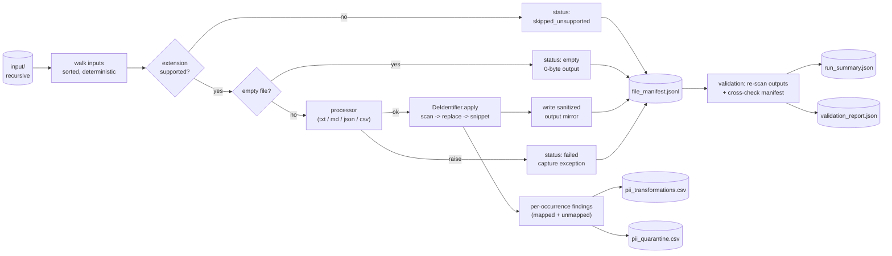
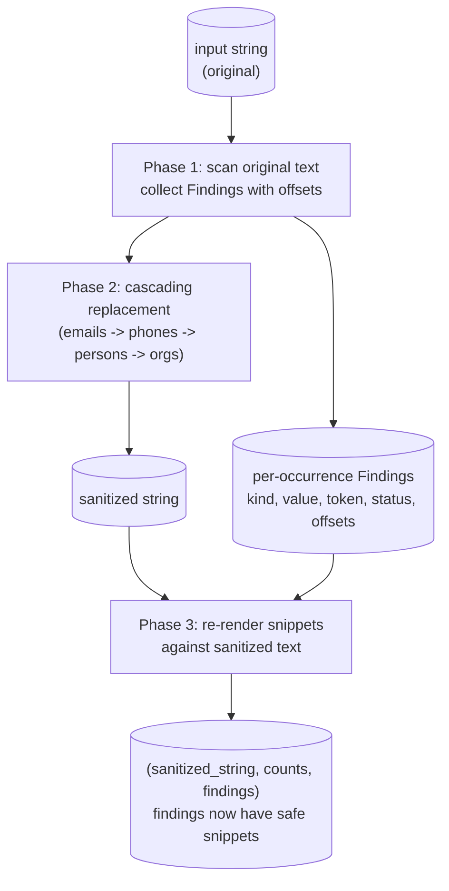

# Local Data Sanitization Pipeline

A deterministic, dependency-free Python pipeline that walks a folder of
exported enterprise data, applies a config-driven de-identification pass
to supported text-like files, and emits a sanitized output tree plus a
full set of audit artifacts a reviewer can use to trust the run without
reading every output file.

The transformation itself is small and easy to audit (regex + an alias
config). The thing being demonstrated is the pipeline *around* the
transformation — failure isolation, deterministic traversal, manifesting,
validation, run observability, and a row-level audit trail of every PII
match the system acted on.

## Table of contents

- [Quick start](#quick-start)
- [How it works](#how-it-works)
- [Supported file types](#supported-file-types)
- [Outputs](#outputs)
- [How de-identification works](#how-de-identification-works)
- [Run status and exit codes](#run-status-and-exit-codes)
- [Determinism and reproducibility](#determinism-and-reproducibility)
- [Edge cases handled](#edge-cases-handled)
- [Sample artifacts](#sample-artifacts-from-the-included-sample_input)
- [Design decisions](#design-decisions)
- [Current limitations](#current-limitations)
- [Production hardening](#production-hardening)
- [Repository layout](#repository-layout)
- [Testing](#testing)
- [Engineering notes](#engineering-notes)

## Quick start

Requires Python 3.9+. Standard library only at runtime; `pytest` is the
only dev dependency.

```bash
python -m pip install -e .[dev]

python -m sanitizer --input sample_input --output output
```

You should see something like:

```
Run 20260508_023409: 5 processed / 4 skipped / 1 failed / 0 empty / 4 unmapped records - validation: PASSED
  summary:             output/reports/run_summary.json
  manifest:            output/reports/file_manifest.jsonl
  validation:          output/reports/validation_report.json
  pii_transformations: output/reports/pii_transformations.csv (52 records)
  pii_quarantine:      output/reports/pii_quarantine.csv (4 records)
  analytics:           output/reports/analytics.html
```

CLI flags:


| flag        | required | description                                               |
| ----------- | -------- | --------------------------------------------------------- |
| `--input`   | yes      | folder to walk recursively                                |
| `--output`  | yes      | folder to write `sanitized/` and `reports/` into          |
| `--config`  | no       | path to entities config (default: `config/entities.json`) |
| `--verbose` | no       | print one line per file outcome + run-boundary events     |


## How it works

End-to-end flow:




In words:

1. **Walk** the input folder recursively in deterministic, sorted order.
2. **Classify** each file by extension. Unsupported extensions are
  recorded but never opened.
3. **Process** supported files through a per-extension processor inside
  `try/except`, so one bad file never aborts the run.
4. **De-identify** each string with a three-phase pass: scan the original
  text for matches, do the cascading replacement, then re-render
   snippets against the fully sanitized text.
5. **Write** sanitized outputs into `<output>/sanitized/`, mirroring the
  input layout.
6. **Emit** six reports under `<output>/reports/` (five machine-readable
  + one interactive HTML dashboard) so a reviewer can audit the run
  from those alone.

The pipeline is entry-pointed via `python -m sanitizer` (argparse +
exit codes; see [Run status and exit codes](#run-status-and-exit-codes)).

## Supported file types


| extension     | reader           | writer                        | notes                                                                 |
| ------------- | ---------------- | ----------------------------- | --------------------------------------------------------------------- |
| `.txt`, `.md` | UTF-8 text       | UTF-8 text                    | sanitize the whole document                                           |
| `.json`       | `json.load`      | pretty `json.dumps(indent=2)` | recursively sanitize string *values*; numbers/bools/null pass through |
| `.csv`        | `csv.DictReader` | `csv.DictWriter`              | sanitize cell *values*; headers preserved verbatim                    |


Anything else is recorded as `skipped_unsupported` in the manifest. The
pipeline never opens or attempts to parse an unsupported file's bytes.

## Outputs

After a run you'll find:

```
<output>/
  sanitized/
    <mirrored input tree, with sanitized files>
  reports/
    run_summary.json
    file_manifest.jsonl
    validation_report.json
    pii_transformations.csv    # one row per *mapped* PII replacement
                               # (only written when at least one exists)
    pii_quarantine.csv         # one row per *unmapped* PII match
                               # (only written when at least one exists)
    analytics.html             # interactive single-page dashboard
                               # (run stats + entity<->file network graph
                               #  + grouped quarantine triage panel)
```

### `run_summary.json`

Single object per run. Top-level totals, per-extension status histogram,
aggregate replacement counts, **unmapped** counts (emails / phones the
regex caught but the config didn't know about), and a compact validation
summary. Designed for piping to dashboards / DAGs / alerts.

### `file_manifest.jsonl`

One JSON line per *input* file (so unsupported / failed / empty files
also get a row). Every line carries:

- `relative_path` (POSIX, relative to `--input`)
- `extension` (lowercased)
- `status` (`processed` / `skipped_unsupported` / `failed` / `empty`)
- `input_sha256` (always set if the file was readable)
- `output_sha256` and `output_path` (set when an output file exists,
including for `empty` files which have a 0-byte output and the
SHA-256 of `b""`)
- `records_processed` (rows for CSV, top-level array length for JSON,
1 for text/markdown)
- `replacements` (counts of mapped values per category)
- `unmapped` (`{emails, phones}` counts of matches that hit the
placeholder fallback and were routed to the quarantine report)
- `error` (string if `status == "failed"`, otherwise `null`)

### `validation_report.json`

Four crisp checks. Every check has `name`, `passed`, and `findings` (a
count). The pipeline runs these *after* writing every other artifact so
the manifest is the input the validator audits, not just an in-memory
view.

1. `no_raw_emails_in_sanitized_outputs` — re-scans every file under
  `sanitized/` for raw email patterns.
2. `no_raw_phone_numbers_in_sanitized_outputs` — same, for phones.
3. `processed_files_have_outputs` — every manifest row with
  `status == processed` has an `output_path`, an `output_sha256`, and
   the file actually exists on disk.
4. `all_input_files_accounted_for` — every file under the input root
  appears exactly once in the manifest (catches both missing and
   duplicated rows).

### `pii_transformations.csv` and `pii_quarantine.csv`

Row-level reports — one CSV row per regex match the de-identifier acted
on. Both files share a single 8-column flat schema (no nesting), so CSV
is the natural format: opens directly in Excel, BigQuery, pandas,
`csvkit`, etc., without parsing JSON.

The header line is stable and emitted by both files:

```
file,kind,value,value_hash,token,status,location,snippet
```

Column reference:


| column       | description                                                                                                                                                                                          |
| ------------ | ---------------------------------------------------------------------------------------------------------------------------------------------------------------------------------------------------- |
| `file`       | input file relative path (POSIX)                                                                                                                                                                     |
| `kind`       | `email`, `phone`, `person`, or `organization`                                                                                                                                                        |
| `value`      | normalized raw value (lowercased email, digits-only phone, verbatim alias for persons / orgs)                                                                                                        |
| `value_hash` | first 8 chars of `sha256(value)` — stable cross-document dedup key                                                                                                                                   |
| `token`      | what the value was replaced with (e.g. `EMAIL_001`, `PERSON_002`, `<UNMAPPED_EMAIL>`)                                                                                                                |
| `status`     | `mapped` (configured) or `unmapped` (regex hit, no config entry yet)                                                                                                                                 |
| `location`   | structural location in the source file:                                                                                                                                                              |
|              | - text/markdown: `line N, column M` (1-indexed)                                                                                                                                                      |
|              | - JSON: a JSON path like `$.issues[1].comments[0].body`                                                                                                                                              |
|              | - CSV: `row N, column "X"` (1-indexed data rows; header is row 0)                                                                                                                                    |
| `snippet`    | ~60 chars context on each side, **rendered against the fully sanitized text** so the value appears as its token / placeholder and any neighbouring PII is already tokenized. Safe to log on its own. |


CSV quoting follows RFC 4180 (`csv.QUOTE_MINIMAL`): cells containing
commas or double-quotes get wrapped in double-quotes; embedded
double-quotes are escaped by doubling (so a `location` like
`row 4, column "from"` is written as `"row 4, column ""from"""`).

`**pii_transformations.csv`** contains the rows where `status == mapped` —
the row-level audit log of every successful PII transformation across
emails, phones, person aliases, and org aliases. This is what a reviewer
uses to verify "every replacement we made was the one we intended" and a
data engineer uses to compute redaction density per source.

`**pii_quarantine.csv**` contains the rows where `status == unmapped` —
matches that hit the regex but had no entry in the config. The triage
loop is straightforward: open the file, look at `value` and `snippet`,
decide whether to add the value to `config/entities.json`, re-run; the
finding moves from `pii_quarantine.csv` to `pii_transformations.csv`
on the next run.

Either file is **only written when at least one row exists** — we don't
ship empty files just to look busy, so a quarantine-free run leaves the
reports directory uncluttered.

Both PII reports carry raw values (the `value` field) so an operator can
act on findings. Sanitized outputs and snippets remain log-safe
regardless. In a tighter security posture, both PII CSVs would live
behind stricter access controls than the rest of the artifacts.

### `analytics.html`

A single-page interactive dashboard rendered per run, sitting alongside
the machine-readable artifacts. It exists so a reviewer can open one
file in a browser and form a complete picture of the run without
parsing JSON / CSV by hand.

The page is **self-contained** except for one CDN script tag for the
`vis-network` graph library. The Python side stays stdlib-only — no
new runtime dependencies, no build step, no React / bundler. All the
data is embedded in the HTML at write time as a `<script
type="application/json">` block; the inline JS reads it back with
`JSON.parse` and renders three regions:

1. **Header strip with run-level stat tiles.** Run id and timestamps
   followed by 8 color-coded tiles — `Files Discovered / Processed /
   Skipped / Failed / Empty / Mapped Replacements / Unmapped Records /
   Validation`. Tiles flip yellow when there are warnings (skipped /
   empty / unmapped non-zero), red on failures, and green when
   validation passes.

2. **Entity ↔ file network graph.** An interactive force-directed
   graph (vis-network) where:
   - **File nodes** are blue boxes, sized by replacement count so heavy
     files visually pop.
   - **Entity nodes** are color-coded ellipses by kind: green for
     persons, orange for organizations, purple for emails, pink for
     phones. Each one is labeled with its canonical token
     (`PERSON_001`, `ORG_002`, etc.); hovering reveals the raw value.
   - **Edges** connect file → entity, weighted by occurrence count
     (rendered as edge thickness). Hovering an edge shows a
     `"N occurrences"` tooltip.

   On the bundled sample input this is 16 nodes and 35 edges; on a
   real ingest the graph immediately surfaces which files share which
   entities and which canonical entity is the busiest.

3. **Quarantine triage panel.** Unmapped values grouped by `(kind,
   value, hash)` and sorted by occurrence count, most-frequent first.
   Each group shows the kind badge, the raw value, the content hash
   for cross-doc dedup, and the per-occurrence detail
   (`file @ location` plus the sanitized snippet). On a clean run the
   panel collapses to a single green "No unmapped values - clean run"
   tile.

The dashboard header also carries `<a href="...">` links back to all
five sibling artifacts, so a reviewer can pivot from the visual into
the raw data without leaving the page.

The dashboard is **always written**, even for clean runs — there's
always something to show (at minimum: the stat tiles + the
entity-file graph). Empty runs still produce a valid HTML page with
a "no findings" panel.

## How de-identification works

### Replacement order

Replacement order is hard-coded for correctness:

```
emails  ->  phones  ->  persons (longest alias first)  ->  organizations (longest alias first)
```

Each pass narrows the surface the next pass sees. The order isn't a
preference — every other order corrupts at least one input we care
about. Worked examples:

**Why emails first.** Take the input string `Mail goes to sarah@betahealth.io next week`:

- *Wrong order* (orgs first): the `BetaHealth` alias matches at offset
20, replaces in place, producing `Mail goes to sarah@ORG_001.io next week`. The email regex now scans this corrupted string, sees no
valid email, leaves the half-tokenized fragment in the output.
`sarah` and `.io` leak.
- *Correct order* (emails first): `EMAIL_RE` matches the whole
`sarah@betahealth.io` substring as one unit and replaces with
`EMAIL_002`, producing `Mail goes to EMAIL_002 next week`. The org
pass then runs and finds nothing to do — `BetaHealth` no longer
exists in the text. The email is fully replaced; no leakage.

**Why phones before names/orgs.** Configured aliases are mostly
letters, but if any alias contained digits (a product name like
`Office365`, an account ID, etc.) and a phone-shaped substring
overlapped, the alias pass running first could chew apart the phone.
Phones are also a much smaller, well-bounded token shape (10–11
digits with separators), so taking them off the table before the
broader alias regexes run prevents any cross-talk.

**Why longest alias first within a group.** Consider
`Sarah Chen and Sarah are the same person.` with persons configured as
`[{aliases: ["Sarah Chen", "Sarah"]}, ...]`:

- *Without longest-first*: the `Sarah` alias runs first and matches
twice — at position 0 (in `Sarah Chen`) and at position 19. Result:
`PERSON_002 Chen and PERSON_002 are the same person.` — a stray
`Chen` is left behind because we ate `Sarah` mid-name.
- *With longest-first*: `Sarah Chen` runs first and matches at
position 0, becoming `PERSON_002`. The shorter `Sarah` then
matches only the standalone occurrence at position 19. Result:
`PERSON_002 and PERSON_002 are the same person.` — clean.

Same logic for orgs: `Acme Inc.` runs before `Acme` so a sentence
like `Met with Acme Inc. yesterday` doesn't become
`Met with ORG_002 Inc. yesterday`.

`_build_alias_rules` in `src/sanitizer/deid.py` does this sort
explicitly with `rules.sort(key=lambda r: (-len(r.alias), r.alias))`.

### Word-boundary anchors: lookarounds, not `\b`

Alias regexes use `(?<!\w)` / `(?!\w)` lookarounds rather than `\b`.
The reason is `Acme Inc.` — an alias that *ends in a non-word character*
(the `.`).

- `\b` is defined as a transition between a word char (`[A-Za-z0-9_]`)
and a non-word char. In `Acme Inc. is the parent`, the position
*after* the `.` is a transition between two non-word chars (`.` and
space). That's not a word boundary, so a `\b`-anchored regex
`\bAcme Inc.\b` may or may not match depending on what follows;
the behaviour is fragile and engine-dependent.
- `(?<!\w)Acme Inc\.(?!\w)` says explicitly: "the char before the
match is not a word char (or it's start-of-string), and the char
after isn't a word char either." Works at any position in the
string regardless of trailing punctuation.

This is also why the email regex still uses `\b` — emails always
start and end with word chars, so `\b` is well-defined for them.

### Three-phase `apply()`

The de-identifier internally runs in three phases so that locations
in reports and snippets in reports are *both* honest:




**Phase 1 — Scan the original text once for every transformation.**
`DeIdentifier._scan_all_findings(text)` runs `EMAIL_RE.finditer`,
`PHONE_RE.finditer`, then iterates compiled person/org alias
patterns in longest-first order. For each match it produces a
`Finding(kind, value, value_hash, token, status, start_offset, end_offset)` with offsets *in the original text*. Higher-priority
matches register their `(start, end)` span in a `covered` list, and
later matches that fall inside an already-covered span are dropped.
That's how:

- a phone-shaped substring inside an email match (e.g. the digits in
`+1-212-555-0199@example.com`) gets credited to the email match
alone — the email span covers the whole address, the phone match
inside it is dropped;
- the shorter `Sarah` alias is dropped at offset 0 of `Sarah Chen and Sarah …` because `Sarah Chen` (longer, scanned first) already
covers (0, 10);
- a person alias and a same-text org alias don't both fire — persons
are scanned first, orgs second, with the unified `covered` list
preventing double-counting.

The reason this phase is separate is offset honesty: positions in
the *original* text are stable, so the line/column or JSON-path or
row/column the processor computes from those offsets points at the
input file the operator opens. If we tried to capture offsets while
also doing replacements, every replacement that changes the string
length shifts every offset after it, and a finding's "line N" is
suddenly line N of a string the input never literally contained.

**Phase 2 — Cascading replacement.** With findings already captured,
this phase only has to produce the sanitized output:
`_replace(text, EMAIL_RE, mapping, normalize, placeholder)` runs four
times in order, mapped values become their tokens and unmapped
emails/phones become the placeholders. Per-pass match counts are
returned but discarded — counts come from findings instead, so
there's a single source of truth.

**Phase 3 — Re-render snippets from the sanitized text.**
`_attach_sanitized_snippets(findings, sanitized_text=text)` walks the
findings in document order and, for each one, advances a per-token
cursor into the sanitized text to locate the Nth occurrence of that
token. It then renders a ±60-char window around that occurrence:

```python
def _snippet_around(text, start, end, window=SNIPPET_WINDOW):
    pre_start = max(0, start - window)
    post_end = min(len(text), end + window)
    leading_ellipsis = "..." if pre_start > 0 else ""
    trailing_ellipsis = "..." if post_end < len(text) else ""
    snippet = f"{leading_ellipsis}{text[pre_start:post_end]}{trailing_ellipsis}"
    return " ".join(snippet.split())  # collapse whitespace
```

Because the snippet is rendered against the *fully* sanitized text,
the focal value already shows as its placeholder/token, *and* any
other PII in the surrounding 120 chars is also already a token.
That's how a quarantine snippet ends up looking like:

```
... vendor not yet onboarded: <UNMAPPED_EMAIL> Vendor escalation line: <UNMAPPED_PHONE> ...
```

instead of leaking the *other* unmapped value (or any neighbouring
person/org name) into the report.

Why this matters: an early version of the pipeline fused scan +
replace into one pass (the natural-feeling implementation). It
shipped a quarantine row whose "phone at line 9" was actually on
line 10 of the source file, because the email replacement above it
had shortened the prior text by 18 characters. The three-phase
split fixes both the offset bug *and* a subtler privacy bug
(snippets carrying a neighbour's raw value).

### Unmapped values and the operator triage loop

Unmapped matches (regex-matched but absent from the config) are
deliberately given a *generic* placeholder rather than a stable
hash-based pseudonym. The reason is workflow honesty: if an operator
hasn't reviewed a value, the sanitized output shouldn't make it look
just as final as a properly-mapped `EMAIL_001`. A reader staring at a
`EMAIL_AUTO_a3f9b21c` in the output can't tell at a glance whether
that's a known entity or an unreviewed one — and that's the kind of
ambiguity that causes incidents.

The placeholder approach makes the unreviewed state visually obvious
in the sanitized text, *and* every unmapped occurrence becomes a row
in `pii_quarantine.csv` with `value`, `value_hash`, `location`, and
sanitized `snippet`. Concretely the triage loop looks like:

1. Operator opens `pii_quarantine.csv`. Sorts by `value_hash` (groups
  the same unknown value across files).
2. Sees a row like:
  ```
   docs/onboarding_notes.md, email, vendor.support@externalpartner.com,
   aedb8969, <UNMAPPED_EMAIL>, unmapped, "line 9, column 36",
   "...External vendor not yet onboarded: <UNMAPPED_EMAIL> ..."
  ```
3. Decides the vendor is real and worth tracking. Adds an entry to
  `config/entities.json`:
4. Re-runs the pipeline. The same finding now lands in
  `pii_transformations.csv` with `status=mapped, token=EMAIL_005`.
   Cross-document dedup means **all N occurrences** of that vendor —
   in markdown, CSV, JSON, anywhere — get fixed by that one config
   change.

This is also why two reports share a schema: a row migrates from
quarantine to transformations on the next run with no other field
changes, and any tooling consuming both files sees the same shape.

The validation contract — "no raw email patterns in sanitized
outputs" — is honest under this scheme regardless of how complete the
config is. Even a fresh deployment with an empty entities config still
produces a sanitized tree with zero raw emails (everything becomes a
placeholder), plus a quarantine.csv that *is* the operator's
prioritized to-do list.

### Configuration

`config/entities.json` is **person-centric**: every fact about an
entity (aliases, emails, phones) lives under that entity, so the
relationship between `Sarah Chen`, `sarah@betahealth.io`, and
`+1-212-555-0199` is explicit in the file rather than inferred from
co-occurrence — the shape an entity-resolution layer needs anyway.

```json
{
  "persons": [
    {
      "canonical_id": "PERSON_001",
      "aliases": ["John Miller", "John"],
      "emails": [{"value": "john@acme.com", "token": "EMAIL_001"}],
      "phones": []
    },
    {
      "canonical_id": "PERSON_002",
      "aliases": ["Sarah Chen", "Sarah"],
      "emails": [{"value": "sarah@betahealth.io", "token": "EMAIL_002"}],
      "phones": [{"value": "+1-212-555-0199", "token": "PHONE_001"}]
    }
  ],
  "organizations": [
    {"canonical_id": "ORG_001", "aliases": ["BetaHealth"]},
    {"canonical_id": "ORG_002", "aliases": ["Acme Inc.", "Acme"]}
  ]
}
```

**Top-level shape is just two arrays.** `persons` and `organizations`
are the canonical entity lists. Emails and phones live under the
person who owns them. The flat dicts that the runtime needs
(`{normalized_value: token}` for fast lookup during replacement) are
*derived* from this structure at load time by `from_config_dict`,
not stored separately. That keeps the on-disk shape readable and the
in-memory shape efficient, with no duplication.

**Phone keys are normalized to digits at load time.** The runtime
lookup key is the digit-only canonical form, so all of these refer
to the same configured token:

```
+1-212-555-0199   ->   _normalize_phone -> "+12125550199"
+1 212 555 0199   ->   _normalize_phone -> "+12125550199"
+12125550199      ->   _normalize_phone -> "+12125550199"
```

The implementation is six lines:

```python
def _normalize_phone(value: str) -> str:
    value = value.strip()
    plus = "+" if value.startswith("+") else ""
    digits = re.sub(r"\D", "", value)
    return plus + digits
```

The same normalizer runs at *match time* on every regex hit — so the
input `(212) 555-0199` (no country code, parentheses) at runtime
also normalizes to `2125550199`, which doesn't match the configured
key `+12125550199` and therefore gets routed to quarantine instead
of silently wrong-mapping. (If you want the no-country-code variant
mapped to the same person, you add it as a second `phones[]` entry
under that person — the loader's "same value, same token is OK"
rule lets you list both forms.)

Email normalization is similar but simpler:
`_normalize_email = lambda v: v.strip().lower()`.

**Loader is strict, and fails loudly.** `_add_pii_entry` raises a
`ValueError` at startup for two distinct config bugs:

```
# Missing field:
ValueError: Invalid email entry under 'PERSON_A': expected
{'value': ..., 'token': ...}, got {'value': 'alice@example.com'}

# Conflicting mapping (same value, two tokens, two different persons):
ValueError: Conflicting email mapping for 'shared@example.com'
(owner 'PERSON_B'): already mapped to EMAIL_A, new token EMAIL_B
```

Idempotent restatements are explicitly allowed — a config can list
`alice@example.com` and `ALICE@example.com` both mapping to
`EMAIL_A` (case variants of the same address), because they normalize
to the same key and the same token, so there's nothing to conflict.
This is the "be strict, but not pedantic" side of the contract.

**Anything the regex matches but the config doesn't list** — an
unknown email or phone — is replaced with the placeholder
`<UNMAPPED_EMAIL>` / `<UNMAPPED_PHONE>` in the sanitized output and
routed to `pii_quarantine.csv` for operator triage. See
[pii_transformations.csv and pii_quarantine.csv](#pii_transformationscsv-and-pii_quarantinecsv)
for the per-occurrence schema, which is shared between the mapped
and unmapped reports.

## Run status and exit codes

`run_status` in `run_summary.json` is one of:


| status                    | meaning                                                                                                                                      |
| ------------------------- | -------------------------------------------------------------------------------------------------------------------------------------------- |
| `completed`               | every input was processed successfully; no unsupported, failed, empty, or unmapped findings                                                  |
| `completed_with_warnings` | the pipeline finished but produced at least one of: skipped unsupported file, failed file, empty file, or unmapped PII finding               |
| `failed`                  | catastrophic, before any reports could be produced (e.g. input folder doesn't exist, config unreadable). Reserved for top-level CLI handling |


CLI exit codes map onto this:

- `**0`** — `run_status == completed` AND validation passed.
- `**2**` — `completed_with_warnings`, OR validation found a leak. The
run finished and produced full reports; a human (or CI) should look at
them.
- `**1**` — catastrophic failure (`failed` status, or before the
pipeline could even start).

## Determinism and reproducibility

Determinism is a foundational property here, not a nice-to-have. Three
concrete consumers depend on it:

- **A reviewer auditing the run** can re-run the pipeline themselves
and get exactly the same sanitized output, byte for byte. If the
output drifts run-to-run, the reviewer can no longer reason about
whether a difference is "expected vs broken."
- **CI / regression detection.** A diff against a prior run's
artifacts is the cheapest possible regression signal — but only if
the artifacts are stable absent code changes.
- **Replays during incident response.** "Why did this PII leak through
on Tuesday?" is answerable only if Tuesday's run is reproducible
from the same input + config + code commit.

Five things combine to make the sanitized output tree byte-identical
across runs on the same input + config.

### 1. Sorted traversal

`os.walk` does **not** sort by default. On ext4 it tends to return
files in roughly inode-allocation order, on NTFS it can be
insertion-order, on APFS the b-tree iteration order may vary by
case-folding rules. Even on a single machine, repeated runs after
add/delete operations can shift the order. Cross-OS, it's basically
random.

`iter_input_files` in `src/sanitizer/utils.py` overrides this by
sorting at every level of the walk:

```python
def iter_input_files(root: Path) -> Iterator[Path]:
    for dirpath, dirnames, filenames in os.walk(root):
        dirnames.sort()                          # in-place; affects walk order
        for name in sorted(filenames):
            yield Path(dirpath) / name
```

Two lines of sorting do all the work. They're easy to gloss over, but
each one has a distinct job, and the combination is what produces
byte-stable artifact ordering. The rest of this section unpacks
exactly what each sort controls and shows the difference on a real
input tree.

#### What `os.walk` actually yields

For each directory it visits, `os.walk` yields a 3-tuple
`(dirpath, dirnames, filenames)`:

- `dirpath` — the directory currently being visited.
- `dirnames` — a *mutable list* of subdirectory names directly under
  `dirpath`.
- `filenames` — a list of regular-file names directly under `dirpath`.

The names in those two lists come from a single `readdir()`-style
syscall, the same one your shell's `ls` makes. **The order they come
back in is whatever the filesystem returns.** That's the source of
the nondeterminism.

The crucial detail is that `dirnames` is passed *by reference* back
to `os.walk`'s internal state. Whatever you do to that list — sort
it, filter it, reorder it — affects the *next* tuple `os.walk`
yields, because after your iteration body returns, `os.walk` re-reads
`dirnames` to decide which subdirectory to descend into next.

That is why the call has to be `dirnames.sort()` (in place) and not
`sorted(dirnames)` (returns a new list). The latter would build a
sorted copy and immediately throw it away — the original `dirnames`
list `os.walk` is about to consume would still be in filesystem
order.

#### Two sorts, two jobs

| call                | what it sees             | what it controls                                          |
| ------------------- | ------------------------ | --------------------------------------------------------- |
| `dirnames.sort()`   | the subdirectory list    | order in which `os.walk` *descends into* subdirectories   |
| `sorted(filenames)` | the file list            | order in which files inside the current directory are *yielded* |

You need both. Either one alone leaves a hole:

- **Without `dirnames.sort()`** — files inside each directory come
  out in sorted order, but `os.walk` visits the *directories* in
  filesystem order. So `slack/` might be processed before `docs/` on
  one machine and after it on another. Manifest rows shuffle by
  directory.
- **Without `sorted(filenames)`** — directories are visited in the
  right order, but files inside each one come back in filesystem
  order. `inbox.csv` might appear before `onboarding_notes.md` on
  one run and after on the next. Manifest rows shuffle within each
  directory.

#### Worked example

Take the bundled `sample_input/` tree:

```
sample_input/
├── archives/archive.zip
├── contracts/contract.pdf
├── docs/customer_notes.txt
├── docs/onboarding_notes.md
├── email/inbox.csv
├── jira/issues.json
├── screenshots/screenshot.png
├── slack/general/thread_001.json
├── slack/malformed_thread.json
└── spreadsheets/model_export.xlsx
```

Suppose we comment out **both** sort calls and run the iterator on a
fresh ext4 checkout. We might get:

```text
slack/general/thread_001.json
slack/malformed_thread.json
contracts/contract.pdf
email/inbox.csv
docs/onboarding_notes.md
docs/customer_notes.txt
jira/issues.json
screenshots/screenshot.png
archives/archive.zip
spreadsheets/model_export.xlsx
```

Unzip the same tree on Windows and run the iterator there:

```text
archives/archive.zip
contracts/contract.pdf
docs/onboarding_notes.md
docs/customer_notes.txt
email/inbox.csv
jira/issues.json
screenshots/screenshot.png
slack/malformed_thread.json
slack/general/thread_001.json
spreadsheets/model_export.xlsx
```

Same files, same content, two completely different orderings. The
manifest rows would be in different order, the per-extension status
histogram would be built in different order, the PII CSVs' rows
(which are written file-by-file) would shift, and the
`output_sha256` values in the manifest would still match per file
but in different positions.

With both sort calls active, **every** run on **every** filesystem
produces the canonical ordering:

```text
archives/archive.zip
contracts/contract.pdf
docs/customer_notes.txt
docs/onboarding_notes.md
email/inbox.csv
jira/issues.json
screenshots/screenshot.png
slack/general/thread_001.json
slack/malformed_thread.json
spreadsheets/model_export.xlsx
```

Notice the depth-first behavior: `slack/general/thread_001.json` is
emitted before `slack/malformed_thread.json` because once `os.walk`
descends into `slack/general/`, it processes everything in there
before coming back up to emit `slack/`'s own remaining files. That
behavior is provided by `os.walk`; the sort just makes it stable.

You can see this directly without running the pipeline:

```python
from pathlib import Path
from sanitizer.utils import iter_input_files

for p in iter_input_files(Path("sample_input")):
    print(p.relative_to("sample_input").as_posix())
```

Run that twice in a row, on two different machines, after deleting
and recreating files in the tree — the output is the same every
time.

#### How this is enforced

The test
`test_pipeline.py::test_running_twice_produces_byte_identical_sanitized_files`
runs the pipeline into two separate temp directories, walks both
`sanitized/` trees, computes SHA-256 of every file pair, and asserts
equality. If the traversal ever loses ordering — for instance, by
someone refactoring `iter_input_files` to drop the `dirnames.sort()`
call — that test fails on the next CI run.

The validation report's check `all_input_files_accounted_for` is a
weaker back-stop: it does *set* equality between input files and
manifest rows, so ordering could drift without the validator
complaining. Catching ordering specifically is the test's job.

#### Edge cases worth knowing

- **Default sort key.** `list.sort()` and `sorted()` with no `key`
  argument sort strings by Unicode code point. That ordering is
  deterministic across Python versions and OS locales — no
  `LC_COLLATE` dependency, unlike command-line `sort`.
- **Case sensitivity.** The default sort is case-sensitive: capital
  letters sort before lowercase, because `'A' (0x41) < 'a' (0x61)`.
  So `Reports.csv` comes before `inbox.csv`. That's usually fine for
  enterprise exports where casing is data; if you wanted
  case-insensitive ordering you'd pass `key=str.casefold`.
- **Repeated runs after add/delete.** On ext4, an unsorted walk
  can return files in roughly inode-allocation order. Delete and
  recreate a file and its inode often differs — so the unsorted
  walk emits it at a different position even on the same machine.
  Sorted traversal makes the order content-derived (the filename
  itself) instead of allocation-derived, so it survives ordinary
  editing.
- **Hidden files.** Files starting with `.` (e.g. `.DS_Store` on
  macOS) sort before alphabetic characters because `.` is U+002E.
  They're not treated specially — they show up in the manifest with
  whatever extension they happen to have, usually as
  `skipped_unsupported`.
- **Symlinks.** `os.walk` doesn't follow symlinked directories by
  default, and `iter_input_files` doesn't override that.
  A symlinked directory appears in `dirnames` but isn't recursed
  into; a symlinked file is read normally.
- **Unicode names.** Code-point sort is deterministic but not always
  intuitive for non-ASCII names — for example, `'é'` (U+00E9) sorts
  *after* `'z'` (U+007A) because its code point is larger. Same on
  every machine, which is what "deterministic" means here, even if
  a human reader might expect locale-aware alphabetic ordering.

#### What goes wrong without it

Drop either sort and the pipeline still produces correct sanitized
content per file — but every consumer that depends on **ordering**
breaks in a quiet way:

- **Diffs become useless.** A reviewer comparing yesterday's manifest
  to today's sees move/copy noise on every line, even when nothing
  actually changed. Real regressions hide in the noise.
- **CI regression checks turn flaky.** Golden-file tests against
  `file_manifest.jsonl` or the PII CSVs would fail randomly,
  depending on which machine ran the job. Teams disable the check
  rather than fix it, and the safety net is gone.
- **Incident replay stops working.** "Re-run from the same input,
  config, and code — get the same output" is the property that
  lets you trust a reproduction. Without ordering, the sanitized
  bytes still match per file but the manifest and PII reports
  don't, so a one-line diff against a known-good run no longer
  proves equivalence.
- **Cross-machine inconsistency.** Same input on a developer's macOS
  laptop and a Linux CI runner produces artifacts that disagree on
  row order. Either someone has to write a sort step into every
  downstream consumer, or the pipeline's outputs are no longer a
  stable contract.
- **Privacy-relevant rows can shift silently.** A row added to
  `pii_quarantine.csv` between runs might appear at a different
  position purely because of filesystem order, making it harder for
  an operator to spot "the new vendor showed up today."

The sort is two lines. The cost of *not* having them is paid by
every downstream consumer, every run, forever.

### 2. Deterministic placeholders

Unmapped values become the *constant* strings `<UNMAPPED_EMAIL>` /
`<UNMAPPED_PHONE>`. There's no per-run randomness, no auto-generated
ID, no "let's hash with the run timestamp." Two runs at different
times produce identical placeholders.

### 3. Content-derived `value_hash`

`value_hash = sha256(value)[:8]` is a *pure function* of the input
value — same value in, same hash out, every time, on every machine.
No salt, no key, no clock dependency. The dedup property the operator
relies on ("the same vendor email gets the same hash everywhere")
falls out of this directly.

This is also the property that makes idempotency tests trivial: hash
the sanitized file's bytes after run A, hash the sanitized file's
bytes after run B, assert equal. The test in
`test_running_twice_produces_byte_identical_sanitized_files`
literally walks both `output/sanitized/` trees and compares byte
content of each file pair.

### 4. Stable column order and writers

The PII CSVs use a **fixed, hard-coded column order** —
`PII_FIELDNAMES = ["file", "kind", "value", "value_hash", "token", "status", "location", "snippet"]` — passed into `csv.DictWriter`
explicitly. Rows are written in document order, file by file (the
processor walks each file's matches in left-to-right offset order
inside the de-identifier's Phase 1 scan). The CSV writer is
configured with `lineterminator="\n"` so line endings are uniform
across operating systems.

JSON outputs use `json.dumps(..., indent=2, ensure_ascii=False)` —
both deterministic given Python 3.7+ dict insertion-order
preservation. The summary's `by_extension` dict is pre-sorted by
extension (`_sort_by_extension`) before being written, so it doesn't
get reordered by however statuses happened to accumulate.

### 5. Reports differ only where they should

The two artifacts that *do* differ across identical re-runs are the
`run_id` and the `started_at` / `completed_at` timestamps in
`run_summary.json`. That's intentional — those exist precisely to
distinguish runs and to provide a chronological audit trail. The
sanitized output tree, the manifest's content (modulo timestamps it
doesn't carry), the validation report, and both PII CSVs are
byte-stable.

### Verifying it

Two ways to see this work:

```bash
# Run twice into different output dirs, diff the sanitized trees.
python -m sanitizer --input sample_input --output out_a
python -m sanitizer --input sample_input --output out_b
diff -r out_a/sanitized out_b/sanitized && echo "byte-identical"

# Or just run the test that asserts this directly.
python -m pytest tests/test_pipeline.py -k "byte_identical" -v
```

The pytest version compares SHA-256 of every sanitized file across
two runs into separate temp directories, so it catches drift down
to a single byte.

## Edge cases handled


| case                                   | behavior                                                                                                             |
| -------------------------------------- | -------------------------------------------------------------------------------------------------------------------- |
| nested directories                     | recursed in deterministic, sorted order                                                                              |
| unsupported extensions                 | recorded as `skipped_unsupported`, never read                                                                        |
| 0-byte files                           | recorded as `empty`, 0-byte output mirrored at the same relative path                                                |
| malformed JSON                         | recorded as `failed` with the exception message; the rest of the run continues                                       |
| malformed CSV / encoding errors        | same isolation — per-file `try/except`                                                                               |
| repeated runs                          | sorted traversal + deterministic placeholders make sanitized files byte-identical across runs                        |
| ISO date strings                       | the phone regex's word-boundary anchors keep it from matching dates like `2026-05-01T10:05:00Z`                      |
| aliases inside other words             | `Mark` does not match inside `Marketing`                                                                             |
| aliases ending in `.`                  | `Acme Inc.` matches at end-of-sentence and before whitespace                                                         |
| unmapped emails / phones               | replaced with `<UNMAPPED_EMAIL>` / `<UNMAPPED_PHONE>` placeholders and routed to `pii_quarantine.csv` per occurrence |
| phone-shaped substring inside an email | the email match wins; the inner phone is not double-flagged                                                          |
| run summary vs manifest drift          | run summary totals are computed from the manifest; the validation report cross-checks both against the input tree    |


## Sample artifacts (from the included `sample_input/`)

The included `sample_input/` has 10 files spread across 8 source-style
folders: 5 processable supported files, 1 deliberately-malformed JSON,
and 4 unsupported placeholders (one each of `.pdf`, `.png`, `.xlsx`,
`.zip`) parked in format-specific directories so the recursive walk
has to find them in different parts of the tree:

```
sample_input/
|-- archives/archive.zip               <- unsupported (.zip)
|-- contracts/contract.pdf             <- unsupported (.pdf)
|-- docs/customer_notes.txt            <- supported
|-- docs/onboarding_notes.md           <- supported, seeds an unmapped email + phone
|-- email/inbox.csv                    <- supported, seeds the same unmapped values in CSV cells
|-- jira/issues.json                   <- supported
|-- screenshots/screenshot.png         <- unsupported (.png)
|-- slack/general/thread_001.json      <- supported
|-- slack/malformed_thread.json        <- malformed (failed)
`-- spreadsheets/model_export.xlsx     <- unsupported (.xlsx)
```

After running:

```bash
python -m sanitizer --input sample_input --output output
```

### `output/reports/run_summary.json`

```json
{
  "run_id": "20260505_041206",
  "started_at": "2026-05-05T04:12:06Z",
  "completed_at": "2026-05-05T04:12:06Z",
  "input_root": "sample_input",
  "output_root": "output",
  "run_status": "completed_with_warnings",
  "files_discovered": 10,
  "files_processed": 5,
  "files_skipped_unsupported": 4,
  "files_failed": 1,
  "empty_files": 0,
  "by_extension": {
    ".csv":   {"processed": 1},
    ".json":  {"failed": 1, "processed": 2},
    ".md":    {"processed": 1},
    ".pdf":   {"skipped_unsupported": 1},
    ".png":   {"skipped_unsupported": 1},
    ".txt":   {"processed": 1},
    ".xlsx":  {"skipped_unsupported": 1},
    ".zip":   {"skipped_unsupported": 1}
  },
  "replacements": {"emails": 14, "phones": 2, "persons": 26, "organizations": 10},
  "unmapped":     {"emails": 2,  "phones": 2},
  "validation":   {"passed": true, "raw_email_findings": 0, "raw_phone_findings": 0}
}
```

The `replacements` totals (14 + 2 + 26 + 10 = 52) match the row count
in `pii_transformations.csv`; the 4 unmapped values match the row
count in `pii_quarantine.csv`. That's the consistency contract
between the summary and the row-level reports.

### `output/reports/file_manifest.jsonl` (selected lines)

A processed JSON file (no unmapped values):

```json
{"relative_path": "slack/general/thread_001.json", "extension": ".json", "status": "processed", "input_sha256": "6d401e60...", "output_sha256": "f351dbd3...", "output_path": "sanitized/slack/general/thread_001.json", "records_processed": 2, "replacements": {"emails": 3, "phones": 1, "persons": 3, "organizations": 1}, "unmapped": {"emails": 0, "phones": 0}, "error": null}
```

The seeded markdown (1 unmapped email + 1 unmapped phone in body text):

```json
{"relative_path": "docs/onboarding_notes.md", "extension": ".md", "status": "processed", "input_sha256": "...", "output_sha256": "...", "output_path": "sanitized/docs/onboarding_notes.md", "records_processed": 1, "replacements": {"emails": 1, "phones": 1, "persons": 6, "organizations": 2}, "unmapped": {"emails": 1, "phones": 1}, "error": null}
```

The seeded CSV (same vendor email + phone, demonstrating row-level capture):

```json
{"relative_path": "email/inbox.csv", "extension": ".csv", "status": "processed", "input_sha256": "...", "output_sha256": "...", "output_path": "sanitized/email/inbox.csv", "records_processed": 4, "replacements": {"emails": 8, "phones": 0, "persons": 6, "organizations": 2}, "unmapped": {"emails": 1, "phones": 1}, "error": null}
```

A malformed JSON file:

```json
{"relative_path": "slack/malformed_thread.json", "extension": ".json", "status": "failed", "input_sha256": "6fcedf77...", "output_sha256": null, "output_path": null, "records_processed": 0, "replacements": {"emails": 0, "phones": 0, "persons": 0, "organizations": 0}, "unmapped": {"emails": 0, "phones": 0}, "error": "JSONDecodeError: Expecting ',' delimiter: line 7 column 1 (char 110)"}
```

An unsupported file:

```json
{"relative_path": "contracts/contract.pdf", "extension": ".pdf", "status": "skipped_unsupported", "input_sha256": "7684662d...", "output_sha256": null, "output_path": null, "records_processed": 0, "replacements": {"emails": 0, "phones": 0, "persons": 0, "organizations": 0}, "unmapped": {"emails": 0, "phones": 0}, "error": null}
```

The empty-file path (`status: "empty"`, 0-byte mirrored output, hash of
`b""`) is part of the supported-edge-case contract and is exercised in
the test suite; it just isn't represented in the bundled sample input
(no zero-byte demo file shipped).

### `output/reports/validation_report.json`

```json
{
  "passed": true,
  "checks": [
    {"name": "no_raw_emails_in_sanitized_outputs",       "passed": true, "findings": 0},
    {"name": "no_raw_phone_numbers_in_sanitized_outputs","passed": true, "findings": 0},
    {"name": "processed_files_have_outputs",             "passed": true, "findings": 0},
    {"name": "all_input_files_accounted_for",            "passed": true, "findings": 0}
  ]
}
```

### `output/reports/pii_transformations.csv` (52 records, first 5 shown)

Every successful PII replacement gets one row. Here are the first five
rows verbatim from a real run:

```csv
file,kind,value,value_hash,token,status,location,snippet
docs/customer_notes.txt,person,John Miller,7158b9c1,PERSON_001,mapped,"line 3, column 1",Customer note: PERSON_001 spoke with PERSON_002 from ORG_001 about the data export. ...
docs/customer_notes.txt,person,Sarah Chen,d3c487ab,PERSON_002,mapped,"line 3, column 24",Customer note: PERSON_001 spoke with PERSON_002 from ORG_001 about the data export. PERSON_002 mentioned t...
docs/customer_notes.txt,organization,BetaHealth,51144c04,ORG_001,mapped,"line 3, column 40",Customer note: PERSON_001 spoke with PERSON_002 from ORG_001 about the data export. PERSON_002 mentioned that PERSON_00...
docs/customer_notes.txt,person,Sarah,7e8c729e,PERSON_002,mapped,"line 5, column 1",... spoke with PERSON_002 from ORG_001 about the data export. PERSON_002 mentioned that PERSON_004 may send over additional files fr...
docs/customer_notes.txt,person,Daniel Lee,e9c81453,PERSON_004,mapped,"line 5, column 22",...m ORG_001 about the data export. PERSON_002 mentioned that PERSON_004 may send over additional files from EMAIL_004. The migrati...
```

### `output/reports/pii_quarantine.csv` (4 records, all)

The seeded vendor email + phone show up in **two** files — the
onboarding markdown and `inbox.csv` — producing four unmapped
findings with location format adapting per file type:

```csv
file,kind,value,value_hash,token,status,location,snippet
docs/onboarding_notes.md,email,vendor.support@externalpartner.com,aedb8969,<UNMAPPED_EMAIL>,unmapped,"line 9, column 36","...SON_003 on May 1, 2026. External vendor not yet onboarded: <UNMAPPED_EMAIL> Vendor escalation line: <UNMAPPED_PHONE> ## Follow-ups - ..."
docs/onboarding_notes.md,phone,+14155550142,abbf04d6,<UNMAPPED_PHONE>,unmapped,"line 10, column 25",...not yet onboarded: <UNMAPPED_EMAIL> Vendor escalation line: <UNMAPPED_PHONE> ## Follow-ups - Send migration checklist to PERSON_002. -...
email/inbox.csv,email,vendor.support@externalpartner.com,aedb8969,<UNMAPPED_EMAIL>,unmapped,"row 4, column ""from""",<UNMAPPED_EMAIL>
email/inbox.csv,phone,+14155550142,abbf04d6,<UNMAPPED_PHONE>,unmapped,"row 4, column ""body""","Hi PERSON_001, please reach our escalation desk at <UNMAPPED_PHONE> to coordinate next week."
```

Four properties to notice across both files:

1. **Same schema, both files.** Same eight columns. The only thing that
  distinguishes a transformation from a quarantine row is `status`
   (and which file it's in).
2. **Location format adapts per processor.** `line N, column M` for
  markdown / text, `row N, column "X"` for CSV, `$.path[i].field`
   for JSON. The schema stays uniform; the format string is
   processor-aware.
3. **Cross-document dedup works.** The same vendor email gets
  `value_hash: "aedb8969"` in both the markdown and the CSV finding;
   same `"abbf04d6"` for the phone. An operator triaging
   `pii_quarantine.csv` sorts by hash and resolves "this same vendor
   in N files" with a single config entry.
4. **Snippets are privacy-clean.** Each finding's snippet is rendered
  from the fully sanitized text, so the focal value is the token /
   placeholder, and any other PII in the surrounding window already
   shows as a token (`PERSON_001`, `PERSON_002`, `PERSON_003`, ...).
   CSV snippets are naturally scoped to the single cell, which is why
   some are short. The `value` field carries the raw content for the
   operator to act on.

### Sanitized output sample

`output/sanitized/slack/general/thread_001.json`:

```json
[
  {
    "source": "slack",
    "channel": "general",
    "user": "EMAIL_001",
    "text": "Hey PERSON_002, I spoke with PERSON_003 from ORG_001. He said we should send the onboarding packet to EMAIL_002.",
    "timestamp": "2026-05-01T10:05:00Z"
  },
  {
    "source": "slack",
    "channel": "general",
    "user": "EMAIL_002",
    "text": "Thanks PERSON_001. Please call me at PHONE_001 if anything is missing.",
    "timestamp": "2026-05-01T10:07:00Z"
  }
]
```

`output/sanitized/docs/onboarding_notes.md` (showing the `<UNMAPPED_*>`
placeholders in context):

```markdown
# ORG_001 Onboarding Notes

Primary contact: PERSON_002
Email: EMAIL_002
Phone: PHONE_001

PERSON_001 from ORG_002 met with PERSON_002 and PERSON_003 on May 1, 2026.

External vendor not yet onboarded: <UNMAPPED_EMAIL>
Vendor escalation line: <UNMAPPED_PHONE>

## Follow-ups
...
```

### `output/reports/analytics.html` (interactive dashboard)

Open the generated `output/reports/analytics.html` in any modern
browser. On the bundled sample input the dashboard renders:

- **8 stat tiles** across the header — `Files Discovered: 10 /
  Processed: 5 / Skipped: 4 / Failed: 1 (red) / Empty: 0 /
  Mapped Replacements: 52 / Unmapped Records: 4 (yellow) /
  Validation: PASSED (green)`.
- **A 16-node, 35-edge graph** clustering the 5 processed files
  around the canonical entities they reference. Files like
  `email/inbox.csv` and `slack/general/thread_001.json` end up
  visually connected to `PERSON_001`, `PERSON_002`, etc. via
  thicker edges where the same person appears multiple times.
- **A 2-group quarantine panel** showing the seeded vendor email
  and phone, each with their two occurrences (one in
  `docs/onboarding_notes.md`, one in `email/inbox.csv`) and the
  sanitized snippet for context.

The header carries direct links back to `run_summary.json`,
`file_manifest.jsonl`, `validation_report.json`,
`pii_transformations.csv`, and `pii_quarantine.csv` so a reviewer
can pivot from the visualization into the underlying data without
leaving the page.

## Design decisions

- **Stdlib only at runtime.** Every dependency is a future support
burden, and this code is meant to be auditable line-by-line. The
six modules used — `re`, `json`, `csv`, `hashlib`, `argparse`,
`pathlib` — are all part of Python's standard library, no
`pip install` needed. (Worth being explicit: `re` is the stdlib
regex module shipped with Python; the third-party PyPI package
`regex` — different name — has more features but isn't used here.)
The only non-stdlib dependency is `pytest`, and it's *dev-only*.
- **Source layout (`src/sanitizer/...`).** Prevents accidentally
importing the working tree instead of the installed package; makes
`python -m sanitizer` the canonical entry point.
- **Per-file failure isolation.** A processor exception is caught at
the pipeline level and converted to a manifest row with status
`failed` and a serialized error. Nothing else aborts.
- **Deterministic traversal.** `os.walk` doesn't sort by default —
filesystem iteration order is implementation-defined and varies
between ext4 / NTFS / APFS, and even between runs on the same
filesystem after add/delete operations. `iter_input_files` calls
`dirnames.sort()` (in-place, so `os.walk` itself descends in sorted
order) and `sorted(filenames)` at every level, which makes file
order identical across operating systems and across repeated runs.
See [Determinism and reproducibility](#determinism-and-reproducibility)
for the full mechanics.
- **Unmapped values get a placeholder, not a pseudonym.** Anything
the regex catches but the config doesn't know about becomes
`<UNMAPPED_EMAIL>` / `<UNMAPPED_PHONE>` and is routed to
`pii_quarantine.csv` with location and snippet. The placeholder
approach is a deliberate workflow choice: an auto-pseudonym like
`EMAIL_AUTO_a3f9b21c` would make the unreviewed state visually
indistinguishable from a properly mapped `EMAIL_001` — bad signal
to a reader, bad audit trail. The placeholder makes "this needs
review" obvious in the sanitized text *and* gives the operator a
CSV row to act on. See
[Unmapped values and the operator triage loop](#unmapped-values-and-the-operator-triage-loop)
for the full triage workflow.
- **Two row-level PII reports, same schema.** Mapped replacements go to
`pii_transformations.csv`; unmapped values go to
`pii_quarantine.csv`. Sharing the schema (with `status` as the only
semantic difference) means tooling can union them with a single
parser, and a row that was unmapped in one run becomes a mapped row
in the next without any consumer having to relearn the format.
- **Three-phase de-id (scan → replace → snippet).** Match offsets
are captured against the original text (so line numbers point at
input files, not at some intermediate post-replacement string).
Replacement runs in cascading order. Snippets are then rendered
against the fully sanitized text so they never carry raw PII from
neighbouring matches. This split is what fixes both the off-by-N
line-number bug a fused scan/replace would have *and* the privacy
bug where one finding's snippet leaks another's raw value. See
[Three-phase apply()](#three-phase-apply) for the full mechanics.
- **Run summary totals are derived from the manifest, then validated.**
The manifest is the source of truth; the summary is a view of it;
validation re-checks both against the input tree. Nothing should
drift silently.
- **Validation is a separate module, not inline.** A reviewer can read
`validation.py` end-to-end in 60 seconds and convince themselves
that the four checks are real.
- **CSV for flat reports, JSON for structured ones.** The two PII
reports have a strictly flat schema, so they're CSV. The manifest
has nested objects (`replacements`, `unmapped`), so it's JSONL.
Format follows shape, not the other way around.

## Current limitations

- **No NER, no coreference, no pronouns.** "She", "him", "the team"
are not resolved. Only the configured aliases and matched
email/phone patterns are replaced.
- **No PDF / image / spreadsheet processing.** The unsupported
placeholder files in `archives/`, `contracts/`, `screenshots/`,
and `spreadsheets/` exist precisely to demonstrate the supported
surface area.
- **Both PII reports carry raw values for triage.** That's
intentional — operators need to be able to act on findings — but in
a hardened deployment both `pii_transformations.csv` and
`pii_quarantine.csv` would live behind stricter access controls
than the rest of the artifacts (manifest, summary, sanitized
outputs), which intentionally do not contain raw PII.
- `**value_hash` is a plain SHA-256 prefix, not HMAC.** It's
computed as `sha256(value)[:8]`. SHA-256 is a *pure* function:
given the input, anyone can compute the output. That's exactly
the property the operator workflow needs — the same vendor email
produces the same `value_hash` in every report, so triage groups
cleanly — but it's *not* a secret-grade pseudonym. An adversary
with the source can pre-compute "the hash of `evil@target.com` is
`7f31c2a8`," which lets them confirm whether that specific value
appears in the quarantine without ever seeing the raw `value`
field.
  HMAC fixes this: `HMAC-SHA256(secret_key, value)[:8]`. The hash
  becomes a *keyed* function — anyone can verify a hash given the
  key, but no one can pre-compute hashes without it. Combined with
  rotating the key periodically, even a leaked report from a prior
  rotation period can't be cross-referenced against current data.
  This is a swap-the-hash-call change in production: the secret
  lives in a secrets manager (AWS KMS, HashiCorp Vault, etc.), the
  pipeline reads it at startup, and `value_hash` becomes
  `hmac.new(key, value, "sha256").hexdigest()[:8]`. Everything else
  about the report shape stays the same.
- **Validation is content-only.** It does not verify token uniqueness
across files, schema compliance, referential integrity, or
quarantine routing.
- **Single-process, in-memory per file.** Each file is opened, fully
read into memory, processed, and written. No worker pool, no
chunked / streaming reads. Three sub-cases of when this matters
and what to do about each:
  *Many small files (e.g. a Slack export with 10K threads).* The
  workload is I/O- and decode-bound, not CPU-bound, so concurrency
  helps. Easiest path: a `concurrent.futures.ProcessPoolExecutor`
  in `pipeline.run` that maps `_process_one` over each input file.
  Per-file outputs are independent (no shared state, no ordering
  dependency between files), so the parallelism is embarrassing.
  Add a `--workers N` CLI flag (default `os.cpu_count()`); collect
  the per-file `(manifest_row, finding_records)` results back in
  the parent and aggregate exactly the same way the sequential
  loop does. The validator and report writers stay sequential —
  they're cheap.
  *Files larger than RAM (e.g. a 10GB log dump).* The current
  processors load whole files. Per file type:
  - `.txt` / `.md`: process in fixed-size chunks (say, 1 MiB) with
  a small lookback buffer (say, 1 KiB) so a regex match spanning
  a chunk boundary still fires. The de-identifier becomes a
  streaming generator that yields sanitized chunks instead of
  returning a whole sanitized string.
  - `.csv`: `csv.DictReader` already iterates row-by-row from the
  underlying file handle, so this just needs the writer side to
  be streaming too — already done. Large CSVs work today
  *modulo* the in-memory `csv.DictWriter` buffer; switch to
  flushing periodically.
  - `.json`: hardest. Standard `json.load` is not streaming. Two
  options: (a) use `ijson` (a third-party SAX-style parser) and
  rebuild the document incrementally — adds a dependency; or
  (b) refuse JSON files above a configurable size threshold and
  log a quarantine row for the file itself.
  *Streaming + concurrency together.* Each worker can stream its
  own file independently — the two upgrades compose cleanly.
  In the current shape, neither upgrade is needed: enterprise text
  exports tend to be < 100 MB per file and the sample run finishes
  in under two seconds. Both knobs would be additive — no schema
  changes to manifest / reports / sanitized output.
- **Phone regex is conservative.** It covers `+CC-XXX-XXX-XXXX`,
`(XXX) XXX-XXXX`, `XXX-XXX-XXXX`, and `XXX.XXX.XXXX`. Exotic
international formats may slip through. A real ingest would use
libphonenumber.
- **No `--strict` flag yet** — failure isolation is hard-wired. Adding
a "fail the run on first malformed file" mode would be a one-liner
if the use case appears.

## Production hardening


| area                  | upgrade                                                                                                                                |
| --------------------- | -------------------------------------------------------------------------------------------------------------------------------------- |
| **pseudonyms**        | HMAC-SHA256 with a managed salt; rotate keys on a schedule                                                                             |
| **token vault**       | separately permissioned store mapping pseudonyms back to originals; the sanitization pipeline only ever holds the forward mapping      |
| **entity resolution** | ML-driven NER + coreference; resolve "she", "the team", first-name-only mentions to canonical entities before pseudonymizing           |
| **modalities**        | PDF/OCR for contracts, spreadsheet support, audio/video transcripts, embedded references inside Office docs                            |
| **DQ + schema**       | per-source validators (Slack vs Jira vs email exports each have different invariants); contract tests as part of the pipeline          |
| **PII routing**       | `pii_transformations.csv` and `pii_quarantine.csv` written to a separately permissioned location; failed-file routing + on-call paging |
| **observability**     | structured logs + metrics for latency, throughput, redaction density, validation findings; lineage IDs propagated through artifacts    |
| **runtime**           | concurrent per-file processing with bounded worker pool; streaming readers for files larger than RAM                                   |
| **security**          | encryption at rest for all artifacts, scoped IAM for output buckets, audit logs for every read                                         |


### Pseudonyms in detail: from plain SHA to keyed HMAC

The first row of that table is short, but it's the row most worth
unpacking, because it changes what a leaked report can be used for.

#### What's in the code today

The current `value_hash` column in both PII CSVs and the dashboard's
quarantine payload is computed as:

```python
value_hash = hashlib.sha256(value.encode("utf-8")).hexdigest()[:8]
```

That gives stable cross-document grouping — the same vendor email
produces the same 8-char hash everywhere — which is exactly the
property the operator workflow needs. But it's a *pure* function:
given the input, anyone can compute the output. There's no key, no
salt, no secret.

#### Why that's a problem under threat

Imagine an attacker gets read access to `pii_quarantine.csv` (or the
analytics dashboard's embedded payload, which carries the same
`value_hash` field). The `value` column is already raw, but suppose
that column was redacted before the report was shared, leaving only
hashes. The attacker can still ask:

> Is `evil-target@example.com` in this report?

They precompute `sha256("evil-target@example.com")[:8]` themselves
and grep for the result. If it's there, they've confirmed the value
was processed by the pipeline — without ever seeing the raw column.
That's a *dictionary attack* (or *membership attack*).

It's especially dangerous for emails and phone numbers because the
search space is small and guessable. There are only ~10¹¹ possible
US phone numbers, and a target's likely email follows naming
conventions of their employer's domain. An attacker doesn't need
collisions — they just need to confirm one specific value's presence.

#### What HMAC changes

Switching `sha256(value)[:8]` to:

```python
import hmac
value_hash = hmac.new(secret_key, value.encode("utf-8"), "sha256").hexdigest()[:8]
```

makes the hash a *keyed* function. Anyone with the same key can
re-derive a value's hash for grouping or look-up; nobody without the
key can. The same vendor email still produces the same 8-char hash
across documents (so the operator's triage workflow keeps working),
but an outside attacker can no longer pre-compute it.

Concretely:

| property                                | plain SHA  | HMAC-SHA256 |
| --------------------------------------- | ---------- | ----------- |
| Same value → same hash within a run     | yes        | yes         |
| Same value → same hash across runs      | yes        | yes (same key) |
| Operator can group by `value_hash`      | yes        | yes         |
| Outsider can confirm "is X in this report?" | yes (any value) | no (key needed) |

#### Where the key lives

The secret must not live in source control, environment files, or
the artifact directory. In production it lives in a managed
secret store and is loaded once at pipeline startup:

- AWS KMS (with the pipeline running under an IAM role authorized
  to `Decrypt` the key)
- HashiCorp Vault (transit secrets engine — Vault holds the key and
  exposes a `hmac` endpoint, so the key never leaves the vault)
- GCP Secret Manager / Azure Key Vault — equivalent shapes

The pipeline's threat model is then "anyone who can read the PII
report cannot also reach the key" — which is enforced by IAM, not by
code.

#### Why rotation matters

A static key has a slow leak: every PII report ever produced under
that key uses the same hashes, so a leak years from now is still
useful to an attacker who learns a target's email today.

Rotation breaks that. With keys rotated on a schedule (say, every
90 days):

- Reports produced before the rotation use the old key.
- Reports produced after use the new key.
- The same email value gets a *different* `value_hash` in each
  rotation window — so an attacker who learns one window's hash for
  a value can't cross-reference it against other windows.

The cost is paid by the operator: cross-document grouping only
works *within* a rotation window. To support triage that spans
windows, the pipeline writes the key version into each artifact:

```json
{
  "run_id": "20260508_023409",
  "value_hash_key_version": "k_2026Q2",
  ...
}
```

so reports can be matched to the key that signed them, and an
operator triaging across rotations knows when grouping breaks.

#### What stays the same

This is a swap-the-hash-call change in the pipeline. It does not
change:

- The PII CSV schema (the `value_hash` column is still 8 hex chars).
- The dashboard's grouping logic (still groups by `value_hash`).
- The validation contract (raw values still don't appear in
  sanitized outputs; the keyed hash is still in the same column).
- Determinism (HMAC is deterministic given the same key and input).

The only meaningful operational change is the new dependency on a
managed secret store, plus a `value_hash_key_version` field in
artifact metadata so reports stay interpretable across rotations.


## Repository layout

```
.
|-- README.md
|-- pyproject.toml
|-- config/
|   `-- entities.json
|-- sample_input/
|   |-- archives/archive.zip                  # unsupported (.zip)
|   |-- contracts/contract.pdf                # unsupported (.pdf)
|   |-- docs/customer_notes.txt
|   |-- docs/onboarding_notes.md              # seeds an unmapped email + phone
|   |-- email/inbox.csv                       # seeds the same unmapped values in CSV cells
|   |-- jira/issues.json
|   |-- screenshots/screenshot.png            # unsupported (.png)
|   |-- slack/general/thread_001.json
|   |-- slack/malformed_thread.json           # malformed JSON, exercises failure isolation
|   `-- spreadsheets/model_export.xlsx        # unsupported (.xlsx)
|-- src/sanitizer/
|   |-- __init__.py
|   |-- __main__.py        # python -m sanitizer entry point
|   |-- cli.py             # argparse wiring + one-line summary
|   |-- pipeline.py        # walk + orchestrate + write all reports
|   |-- deid.py            # DeIdentifier (config + replacement passes + Findings)
|   |-- processors.py      # txt/md/json/csv processors + finding location annotation
|   |-- validation.py      # four post-run checks
|   |-- analytics.py       # single-page HTML dashboard generator
|   `-- utils.py           # hashing, sorted traversal, run id, json/csv io
`-- tests/
    |-- conftest.py         # session-scoped demo_run fixture + isolated input fixtures
    |-- test_deid.py        # 20 cases - replacement, schema invariants, snippets, mapped+unmapped findings
    |-- test_pipeline.py    # 22 cases - dispatch, isolation, PII reports, idempotency, CSV format, analytics dashboard
    `-- test_validation.py  # 5 cases  - clean run + the four check tampering scenarios
```

## Testing

```bash
python -m pytest -q
```

You should see `47 passed` in roughly 1 second. The suite covers:

- the nine baseline scenarios from the original spec,
- boundary cases (ISO dates not matching the phone regex, aliases not
matching inside other words, idempotency on already-sanitized text,
phone-shaped substring inside an email),
- the config schema's invariants (conflict detection across persons,
missing-field validation, idempotent duplicates),
- both PII row-level reports (location accuracy per processor, snippet
privacy, schema sharing between transformations and quarantine,
summary-vs-row totals consistency, no empty files on clean runs,
CSV format / RFC-4180 round-trips),
- the analytics dashboard (file is written, embedded JSON payload has
the expected summary / graph / quarantine shape, snippets in the
payload don't leak raw PII, header carries back-links to the other
five report artifacts), and
- the four validation checks under both clean and tampered conditions.

Tests are parameterized where the same logic applies across PII kinds.
Pipeline tests share a session-scoped `demo_run` fixture so the
sample-input pipeline only runs once per test session — fewer redundant
runs, less per-test boilerplate.

Useful single-test runs while developing:

```bash
python -m pytest tests/test_deid.py -k "longer_alias" -v
python -m pytest tests/test_pipeline.py -k "byte_identical" -v
python -m pytest tests/test_validation.py -k "leaked_email" -v
```

## Engineering notes

A walk-through of the judgment calls behind the implementation. The
journey is part of what this is meant to demonstrate, so this
section runs longer than a typical README appendix.

### Connection to Sunset's operating model

The brief and Sunset's operating model converge on the same problem:
take messy enterprise exports and turn them into cleaner,
anonymized, normalized data that can feed AI training workflows and
other downstream applications. A pipeline serious about that has to
be trustworthy on three axes simultaneously:

- robust handling of mixed, malformed, and unsupported inputs
(failure isolation, deterministic edge-case behavior);
- deterministic de-identification that preserves the relationships
downstream consumers care about;
- observability deep enough that a reviewer can audit a run without
re-reading every output file.

Latency was identified early as a non-constraint - these are batch
ingestion workflows, not request-path. That's not a limitation, it's
an opportunity: it makes room to do thorough sanitization and
quality-control passes in the same run, rather than splitting them
into follow-up jobs that duplicate work or drift out of sync.

Within that scope, the design decision was to keep the actual
transformation small (regex + config-driven mapping) and put the
design weight into the pipeline behavior around it. The
transformation isn't where the interesting problems live at this
scale; the four areas that turn a "script that processes files"
into something a reviewer can trust are.

### The entity config as the backbone

The transformation looks small, but the entity config is the
structurally interesting piece. The current schema is person-centric:
every fact about an entity (aliases, emails, phones) lives under
that entity, so the relationship between `Sarah Chen`,
`sarah@betahealth.io`, and `+1-212-555-0199` is explicit in the file
rather than inferred from co-occurrence. That's the shape an
entity-resolution layer would need anyway - a future ML/NLP-driven
implementation can read the same file, augmented with whatever
linkage and coreference outputs it produces.

In a production version, the structure, linkage, and consistency of
entity parameters would itself become a much larger design
consideration: cross-source coreference, canonicalization rules,
vault-backed pseudonyms, entity lifecycle (when does an entity stop
being an entity?), conflict resolution between sources. Keeping the
schema simple here doesn't preclude any of that; it's a foundation
those layers can land on.

### Observability: surgical, not just summary-level

The brief asked for a run summary plus a per-file manifest. That's
the floor - enough so a reviewer doesn't have to open every output
file to know whether the run succeeded. Three further layers got
added on top of that floor, each addressing a different question
the floor doesn't answer:

- **Independent post-run validation.** The reviewer shouldn't have
to *trust* that the pipeline did what it claimed in the manifest.
`validation_report.json` runs four integrity checks against the
sanitized tree and the input tree independently - a separate
module so a reader can audit the checks themselves in 60 seconds.
- **Row-level transformation + quarantine audit.** A run summary
tells you *what happened*; row-level CSVs tell you *exactly where*.
`pii_transformations.csv` lets a reviewer answer "where exactly
did the `Sarah Chen` swap to `PERSON_002` happen?" with a precise
file + line/row/JSON-path location and a sanitized snippet.
`pii_quarantine.csv` answers the inverse: "show me every place
the pipeline couldn't confidently classify a value, and tell me
why." Both share an 8-column flat schema, with `status` as the
only field that distinguishes them.
- **A visual layer on top of all of that.** `analytics.html` is a
single-page dashboard rendered per run that turns the same data
into something a reviewer can open in a browser without parsing
JSON or CSV: a stat-tile strip across the header, an interactive
entity ↔ file network graph in the middle, and a grouped
quarantine triage panel on the side. It's a deliberately *light*
analytics layer - one HTML file, no Python deps beyond stdlib,
one CDN script tag for the graph library - but it shifts the
"how do I read this run?" surface from "you need to know jq and
csvkit" to "open the file." The header also links back to the
five machine-readable artifacts so the dashboard is a starting
point rather than a replacement for them.

Quarantine specifically reflects an explicit design philosophy: when
the pipeline can't confidently handle a match, it shouldn't silently
auto-pseudonymize and pretend it did. It should route the value
into a structured backlog where the unreviewed state is visible,
with enough context (file, location, masked snippet) for an
operator to act on it. The triage loop is concrete and tight: open
`pii_quarantine.csv` (or scan the analytics dashboard's quarantine
panel), sort by `value_hash` (groups recurrences of the same value
across documents), add the value to `config/entities.json`, re-run;
the finding migrates from quarantine to transformations on the next
pass with a real token, across every file the value appears in.

### Why the de-identification engine is intentionally simple

A more sophisticated transformation - NER, coreference, embeddings -
would change the *core* of the system rather than its periphery.
Tradeoffs around accuracy, recall, latency, and validation become
first-order concerns the moment ML enters the picture, and the
hardest parts of that work are the operator and evaluation
framework around the model, not the model itself. That deserves a
dedicated iteration with real data, not a side-task in a 4-hour
build.

Even within the simple regex + config shape, several judgment calls
earn their keep, and most of them came out of catching a concrete
bug rather than guessing at edge cases up front:

- **Replacement order is hard-coded.** Other orders corrupt at
least one input we care about (e.g. orgs-before-emails would turn
`sarah@betahealth.io` into `sarah@ORG_001.io`). Worked examples
in [How de-identification works](#how-de-identification-works).
- **Lookaround alias boundaries instead of `\b`.** `\b` is undefined
at non-word boundaries; `Acme Inc.` (alias ending in `.`) is the
canonical case that breaks it.
- **Three-phase `apply()`** (scan, replace, snippet) fixes a real
bug discovered while iterating. A fused implementation reported a
phone "at line 9" that was actually on line 10, because the email
replacement above it had shortened the prior text by 18
characters. The same split also fixes a privacy bug where one
finding's snippet leaked another's raw value; both go away when
snippets are rendered against the *fully* sanitized text.
- **Anonymizer mappings are plain canonical IDs**, not HMAC-keyed
pseudonyms. In production they would be deterministic but keyed
with a managed salt - stable across files but resistant to
reverse-engineering by anyone with source access. The swap is a
one-line code change; the missing piece is the key management
around it. See [Production hardening](#production-hardening).

### Working with AI tools: the guardrails themselves need guardrails

AI assistance was used substantially throughout: scaffolding the
module split, drafting first-cut regex patterns, drafting the
recursive JSON walker, drafting README sections, drafting commit
messages. Nothing shipped from a draft without review.

What got verified by hand and locked in with explicit tests:

- The replacement-order logic, especially the email-before-org case
for `sarah@betahealth.io` - would otherwise silently corrupt the
domain.
- The `\b` to lookaround switch after noticing `\b` doesn't work for
`Acme Inc.`.
- The phone regex tightening so it skips ISO timestamps like
`2026-05-01T10:05:00Z` instead of treating them as phones.
- The off-by-one line-number bug that motivated three-phase
`apply()`.

Beyond verifying individual behaviors, a more general pattern earned
its own attention: **as functionality grows fast, AI assistants can
drift past existing test logic.** New features reliably come with
new tests, but it's easy for changes that *should* update existing
expectations to slip through unchanged - the suite stays green
without actually covering the new behavior. So part of the
workflow became actively asking "what isn't this test covering?"
and "is the test suite growing where it should be?", not just
"are the tests green?".

The broader takeaway, made concrete by this build: **guardrails in
AI-supported workflows have to themselves be monitored**. Defining
test coverage, code-review patterns, and validation contracts is a
starting point; making sure the system keeps following them as new
functionality lands is the harder, ongoing work. That same
principle applies to the data pipelines this team builds - both
are systems where a constraint defined once and left alone slowly
stops being a constraint, especially when AI is doing more of the
mechanical work. Building the validation report and the row-level
PII reports into *this* pipeline was, in a small way, the same
shape of move: making the contract observable instead of trusting
it would hold.

### What was deliberately not built

Listed for completeness; concrete upgrade paths and rationale in
[Production hardening](#production-hardening):

- HMAC-keyed pseudonyms with a managed salt + key rotation
- Separately permissioned token vault (forward / reverse mapping split)
- ML/NLP-driven NER + coreference for "she", "the team",
first-name-only mentions
- PDF / image / spreadsheet processors
- Per-source schema validators (Slack, Jira, and email exports each
have different invariants worth contract-testing)
- IAM-scoped routing for the PII reports + on-call paging on
failure / high quarantine volume
- Concurrent / streaming runtime for very many small files or files
larger than RAM

